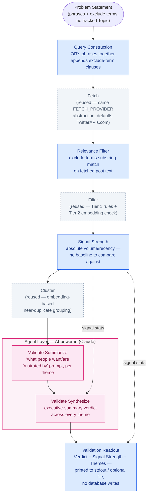
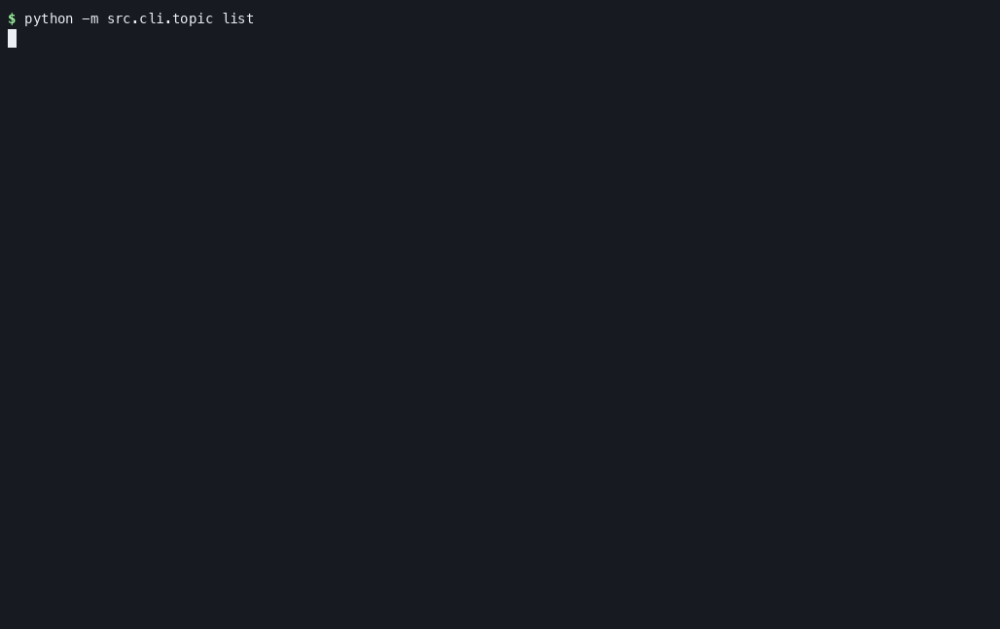

# X Hype Finder

[](https://github.com/Bardiyashavandi/x-hype-finder/actions/workflows/tests.yml)
[](LICENSE)
[](pyproject.toml)

Tell it what to watch — a topic, a ticker, a niche — and it does the timeline-watching for you:
spotting real spikes in interest on X, filtering out bots and manufactured hype, and delivering a
short, ranked, evidence-backed digest of what's actually gaining traction and why.

## Table of Contents

- [Quick Start](#quick-start)
- [About The Project](#about-the-project)
- [Architecture](#architecture)
- [Algorithms](#algorithms)
- [How It Works](#how-it-works)
- [Database Schema](#database-schema)
- [Built With](#built-with)
- [Getting Started](#getting-started)
  - [Prerequisites](#prerequisites)
  - [Installation](#installation)
- [Usage](#usage)
- [Web Dashboard](#web-dashboard)
- [Sample Output](#sample-output)
- [Demo Recording](#demo-recording)
- [Cost Model](#cost-model)
- [Development Process](#development-process)
- [How It Was Built](#how-it-was-built)
- [Roadmap](#roadmap)
- [License](#license)

## Quick Start

Five commands from a clean checkout to a first real digest — assumes Ollama is already running
locally with `nomic-embed-text` pulled and `.env` is filled in (see
[Prerequisites](#prerequisites)/[Installation](#installation) below if not):

```sh
uv sync
cp .env.example .env                 # fill in your API keys before continuing
uv run alembic upgrade head
python -m src.cli.topic add "AI agents"
python -m src.cli.digest run
```

`digest run` prints the new digest's id on completion — read it with:

```sh
python -m src.cli.digest show <digest-id>
```

See [Sample Output](#sample-output) for what real output from that command actually looks like.

## About The Project

Catching emerging hype on X today means constantly watching timelines by hand — which doesn't
scale past a topic or two, and bot/engagement-farming noise makes it hard to trust what looks like
real interest. Enterprise social-listening tools (Brandwatch, Sprinklr, Sprout Social) already
solve this well — real-time capture, sentiment analysis, AI-generated trend narratives — which is a
strong signal the underlying problem is real. But they're built for a different buyer: brand, PR,
and growth teams, priced in the hundreds-to-thousands-per-month range, centered on "what are people
saying about my brand." There's no lightweight, topic-agnostic version built for a curious
individual who just wants to track a topic, ticker, or niche they care about.

X Hype Finder is that version: any topic as a first-class subject, reasoned about with an LLM
rather than a fixed metrics dashboard, on a personal-project budget (see [Cost
Model](#cost-model)). What comes back isn't a wall of raw posts or a dashboard full of numbers —
it's a short, ranked summary: what's trending, why, and how confident the system is that it's real
signal rather than manufactured hype, with the original source posts always one click away.

Full pitch, market analysis, competitive gap, and target users:
[`docs/Product_Brief_X_Hype_Finder.md`](docs/Product_Brief_X_Hype_Finder.md). Detailed
requirements, architecture, and cost model: [`docs/PRD_X_Hype_Finder.md`](docs/PRD_X_Hype_Finder.md).

## Architecture

The system is a strict two-layer split: a **deterministic data pipeline** (rules, statistics, and
embeddings — local via Ollama or hosted via Voyage AI, see [Getting Started](#getting-started) — no
LLM, fully reproducible and unit-testable) hands off to a small **AI agent layer** (Claude) only for
the two stages that genuinely require language judgment — writing the summary and drafting the
post. Everything downstream of a draft is gated by an explicit posting state machine, never a
silent auto-publish.


Stage by stage:

- **Fetch** (`src/pipeline/fetch*.py`) — pulls raw posts for each tracked topic from a pluggable
  third-party X data provider (see [Built With](#built-with)), never the official X read API (100x
  the cost at this volume). Provider-agnostic: every backend returns the same `RawPost`/author-metadata
  shape, selected via `FETCH_PROVIDER` (`src/pipeline/fetch_provider.py`) — same pattern as the
  embedding provider below.
- **Filter** (`src/pipeline/filter.py`) — two tiers, both rule-based. Tier 1 scores each post's
  author metadata (account age, follower/following ratio, posting frequency) against fixed
  thresholds; Tier 2 embeds post text to catch coordinated/duplicate-content bot campaigns a single
  post's metadata wouldn't reveal. No LLM judgment calls what counts as spam.
- **Detect** (`src/pipeline/detect.py`) — compares a topic's current filtered post volume against
  its *own* trailing baseline, never another topic's. Rather than flagging a spike at a fixed
  multiple of the baseline mean (e.g. "3x everything"), which is miscalibrated across volume
  regimes — count data's variance scales with its mean, so a flat ratio is too loose for a
  low-volume topic (ordinary noise clears it trivially) and too tight for a high-volume one (a real
  trend may never reach it) — a spike is current activity clearing the baseline mean by **`K_SIGMA`
  (2.5) effective standard deviations**, a threshold that adapts to each topic's own volume and
  variance instead of one fixed ratio for every topic. Every newly tracked topic also serves a
  **7-day observation period** during which `is_spike` is unconditionally `False`, regardless of
  activity — there's no baseline yet to compare against honestly.
- **Cluster** (`src/pipeline/cluster.py`) — groups filtered posts into themes by embedding
  near-duplicate/related content together, so the digest reads as a handful of coherent stories
  instead of a flat list of individual posts.
- **Rank** (`src/pipeline/rank.py`) — orders every theme across every topic in the run by
  significance, descending, so the digest surfaces the highest-signal items first.
- **Summarize / Draft Post** (`src/agent/`) — the only two stages that call an LLM (Claude), and
  only *after* the deterministic pipeline has already decided what's significant: the model
  explains and drafts, it never decides what counts as a spike or filters noise itself.
- **Posting gate** (`src/posting/`) — every draft is held for manual publishing during a 3-week
  validation period, regardless of confidence. After that, an explicit, reversible toggle enables
  confidence-gated autonomous posting, safeguarded by a live "automated" bio-label check, jittered
  timing, a 5-posts/24h cap, and a kill switch.

### Idea Validation Mode Flow

Idea Validation Mode (`idea-validate run`) is a separate, one-off, non-persisted flow — it reuses
Fetch, Filter, and Cluster unchanged from the pipeline above, but swaps in a phrase-list query, a
new relevance filter, absolute signal strength in place of baseline-relative spike detection, and
two new LLM stages culminating in a top-level executive-summary verdict, with no database writes
at any point.



## Algorithms

The three stages that actually decide what's noise, what's a spike, and what's one story rather
than ten are all deterministic — no LLM judgment anywhere in this section (Constitution Principle
I). This is the logic behind them, not just the boxes in the diagram above.

### Filter — Bot/Noise Detection (`src/pipeline/filter.py`)

**Problem:** a raw fetch for any active topic includes bot amplification, engagement farming, and
spam alongside genuine posts. Deciding "bot or not" per post needs to be cheap (it runs on every
fetched post, every run) but still catch coordinated behavior a single post's metadata can't reveal
on its own — so it's split into two tiers, with the expensive tier gated behind the cheap one.

**Tier 1 — rule-based composite score, 0-100** (`score_tier1`). Each post starts at 0 and accumulates
points from independent, additive signals:

| Signal | Condition | Points |
|---|---|---|
| New account | `account_age_days < 30` | +20 |
| Suspicious follow ratio | `followers < 50` **and** `following > max(followers, 1) × 10` | +20 |
| High posting velocity | `post_frequency > 50`/day | +20 |
| Duplicate text | ≥50% of other posts in the same batch are ≥0.9 similar (`SequenceMatcher` ratio, link-stripped/lowercased) | +25 |
| Link-heavy | URL characters ≥50% of post length | +10 |
| Spam pattern | regex match on `dm me`, `guaranteed profit(s)`, `\d{2,}x gains?`, `free airdrop`, follow-back bait, wallet-solicitation/giveaway-bait (wallet + drop/comment/send + airdrop/giveaway/winner), or a bare/labeled contract address (`0x` hex, `solana:` URI, `CA:` label, or the phrase "contract address") | +25 |
| Cashtag stuffing | ≥6 distinct `$TICKER` cashtags in one post | +20 |

The composite score is capped at 100 and bucketed:

```
score >= 70   → clear_exclude
score <= 20   → clear_keep
otherwise     → ambiguous          (escalated to Tier 2)
```

**Tier 2 — embedding-based coordinated-content check** (`apply_tier2`), run *only* over Tier 1's
`ambiguous` posts — clear-keep and clear-exclude posts never pay for an embedding call at all. This
catches what Tier 1's per-post metadata structurally can't: near-duplicate content posted by
*distinct* accounts in a tight time window, a signature of coordinated amplification a single
post's own metadata looks perfectly clean under. Concretely: for each ambiguous post, embed it and
every other post in the batch, and flag it `excluded_deeper_check` if ≥2 *distinct* authors posted
content ≥0.92 cosine-similar within a 2-hour window. If no coordination signature is found, it falls
back to a stricter composite threshold (≥50, versus Tier 1's own 70) rather than defaulting to keep —
an ambiguous post that fails both checks is still excluded, not given the benefit of the doubt.

No post is ever silently dropped — every post gets a `filter_outcome` (`kept` /
`excluded_rule` / `excluded_deeper_check`) persisted on `SourcePost`, so a filtered-out post is
still auditable via `digest show --full`, not erased from the record. The author metadata Tier 1
scored it against (`followers_count`, `following_count`, `account_age_days`, `post_frequency`) is
persisted on the same row alongside the outcome, for both kept and excluded posts — nullable, since
rows written before these columns existed have nothing to backfill. Post-level engagement counts
(`like_count`, `retweet_count`, `reply_count`, `quote_count`, `view_count`) are persisted the same
way when the active Fetch provider exposes them — currently only `fetch_twitterapis_com.py`; the
original `fetch.py` (TwitterAPI.io) client's response doesn't expose engagement counts, so those
columns stay `null` for posts fetched through it.

**Why two tiers instead of one ML classifier or a single embedding pass over everything:** a
trained classifier needs labeled bot/not-bot data this project doesn't have and can't audit as
easily as an explicit rule list; running embeddings over *every* post regardless of how obviously
clean or spammy it is would multiply embedding-provider cost and latency for zero marginal signal
on the cases Tier 1 already resolves confidently. Gating Tier 2 behind Tier 1's `ambiguous` bucket
means the expensive check only runs where a cheap rule genuinely can't decide.

### Detect — Spike Detection (`src/pipeline/detect.py`)

**Problem:** decide whether a topic's current filtered post volume is a genuine spike in interest —
compared strictly to *that topic's own* trailing baseline, never another topic's — without either
drowning in false positives on quiet topics or missing real trends on already-busy ones.

The naive approach — flag a spike at a fixed multiple of the baseline mean (e.g. "current ≥ 3×
baseline") — is miscalibrated across volume regimes, because count data's variance scales with its
mean (a Poisson-like property): a flat ratio is far too loose for a low-volume topic, where ordinary
day-to-day noise clears it trivially, and far too tight for a high-volume topic, where a real
emerging trend may never reach it. This is the same reasoning behind established
seasonal/statistical anomaly-detection approaches (e.g. Twitter's own Seasonal-Hybrid ESD work),
which likewise reject a fixed threshold in favor of bounds that adapt to a series' own variance
rather than one constant applied uniformly.

`detect_spike` instead flags a spike when current activity clears the baseline mean by
**`K_SIGMA` (2.5) effective standard deviations**:

```
is_spike = current_count >= baseline_mean + K_SIGMA * sigma_eff

sigma_eff = max(
    baseline_stdev,          # the trailing window's own population stdev
    sqrt(baseline_mean),     # Poisson noise floor — variance scales with the mean
    MIN_SIGMA_FLOOR,         # 1.0 — guards near-zero-variance baselines (e.g. flat at 0-1/day)
)
```

`baseline_mean`/`baseline_stdev` are computed over a trailing 7-day window of `TopicBaselineSnapshot`
rows, excluding the current day itself. Every newly tracked topic also serves a **7-day observation
period** (`Topic.observation_period_active`) during which `is_spike` is unconditionally `False`
regardless of activity — there's no honest baseline yet to compare against. `spike_ratio`
(`current ÷ baseline_mean`) is still computed and reported downstream as a magnitude signal even
when it isn't what decides `is_spike`.

**Worked example** (both cases from `tests/unit/test_detect.py`, same `K_SIGMA=2.5`):

- **Low-volume topic**, baseline mean = 1 post/day, current = 3 (a flat 3× move). Under a fixed
  3× rule this registers as a spike (3 ÷ 1 = 3.0 ≥ 3.0) — but at this volume, 3 posts in a day is
  unremarkable noise. `sigma_eff = max(0, √1, 1.0) = 1.0`, so the threshold is `1 + 2.5×1 = 3.5`;
  current = 3 falls short → **not a spike**.
- **High-volume topic**, baseline mean = 1000 posts/day, current = 1100 (a modest 1.1× move). Under
  the same fixed 3× rule this would need 3000 posts to register at all — but a sustained 10% lift on
  1000/day is a real signal. `sigma_eff = max(0, √1000, 1.0) ≈ 31.6`, so the threshold is
  `1000 + 2.5×31.6 ≈ 1079`; current = 1100 clears it → **is a spike**.

Same `K_SIGMA`, same formula, correct call in both directions — because the bound itself scales
with the topic's own baseline variance instead of being fixed.

### Cluster — Thematic Grouping (`src/pipeline/cluster.py`)

**Problem:** turn a flat list of Filter-kept posts into a handful of coherent stories — a digest
of 40 individual posts is unreadable, but a digest of 3-5 *themes* isn't, provided the grouping
itself is honest about what's actually related.

`cluster_posts` embeds every kept post's text and runs scikit-learn's `AgglomerativeClustering`
over the embeddings with **cosine distance** and **average linkage**, using a **distance threshold**
rather than a fixed cluster count:

```
distance_threshold = 1.0 - CLUSTER_SIMILARITY_THRESHOLD   # 1.0 - 0.75 = 0.25
AgglomerativeClustering(n_clusters=None, distance_threshold=0.25, metric="cosine", linkage="average")
```

Posts land in the same cluster only once their pairwise cosine similarity clears **0.75**; nothing
else determines how many clusters come out — `n_clusters=None` explicitly lets the data decide,
rather than forcing a pre-chosen number of themes (as k-means would require) onto whatever content
actually showed up. A post with no sufficiently similar peers becomes a **singleton cluster of
one** rather than being dropped or force-merged into an unrelated group — Cluster never excludes a
post, only Filter does.

**Real example:** a live run against the broad, handle-less topic "AI agents" (`docs/PRD_X_Hype_Finder.md`,
2026-07-31) fetched 40 posts and produced **37 themes** — almost entirely singletons. That's the
correct outcome, not a clustering failure: a keyword that broad pulls in posts that mention "AI
agents" while discussing genuinely unrelated specifics, so they simply aren't 0.75-similar to each
other, and the threshold correctly declines to force them into shared stories they don't belong to.
A narrower, handle-anchored topic sees proportionally larger clusters, since its posts are more
likely to actually be repeating or reacting to the same specific thing.

## How It Works

[Architecture](#architecture) shows the pipeline's shape end to end; [Algorithms](#algorithms) is the
formula reference for the three fully-deterministic stages (Filter, Detect, Cluster). This section is
the fuller engineering walkthrough — every stage in execution order, including the two AI-powered
stages and the posting gate, which Algorithms deliberately doesn't cover (it's scoped to non-LLM
logic only, per Constitution Principle I).

#### Fetch

`get_fetch_provider()` (`src/pipeline/fetch_provider.py`) resolves `FETCH_PROVIDER` to one of two
interchangeable backends — TwitterAPIs.com (default) or TwitterAPI.io — both returning the same
`RawPost`/`AuthorMetadata`/`EngagementMetrics` shape regardless of provider. The search query itself
is built by the shared `src/pipeline/query_builder.py::build_search_query()`: a topic name is quoted
as an exact phrase (`"AI agents"`) unless it starts with `$`, in which case it's passed bare so X's
own cashtag operator matches ticker mentions specifically, rather than a literal-text search that also
catches unrelated words in other languages — see [How It Was Built → Cashtag query
bug](#cashtag-query-bug) for the incident that motivated this. Handles resolve to `from:<handle>` OR
clauses; the whole query is windowed with `since_time`/`until_time` Unix timestamps. Pagination runs
through `_fetch_page`, wrapped in `retry_with_backoff` for transient failures, up to
`MAX_POSTS_PER_RUN` posts per topic per run — paced deliberately on the TwitterAPI.io path after a
free-tier rate limit surfaced in production; see [How It Was Built → Rate-limit pacing
discovery](#rate-limit-pacing-discovery).

#### Filter

Two tiers, both fully deterministic (Constitution Principle I) — Tier 1's 7-signal weighted score
buckets every post into `clear_keep`/`clear_exclude`/`ambiguous`, and Tier 2's embedding-based
coordinated-content check runs only over what Tier 1 couldn't confidently resolve, so the expensive
check never runs on posts a cheap rule already handled. Full weights, thresholds, and the two-tier
rationale: [Algorithms → Filter](#algorithms).

#### Detect

Compares a topic's current filtered volume against its own trailing baseline using a variance-aware
bound (`K_SIGMA=2.5` effective standard deviations, adapting to each topic's own volume regime)
instead of a fixed multiplier, plus a 7-day observation gate for newly tracked topics. Full formula
and the low-volume/high-volume worked example: [Algorithms → Detect](#algorithms).

#### Cluster

Embeds every Filter-kept post and runs scikit-learn's `AgglomerativeClustering` with a cosine-distance
threshold (0.25, i.e. 0.75 similarity) rather than a fixed cluster count, so the number of themes is
whatever the actual content supports — including singleton clusters for posts with no close peers.
Full mechanics and a real example run: [Algorithms → Cluster](#algorithms).

#### Rank

`src/pipeline/rank.py` orders every Theme across every topic in the run by significance, descending —
a pure sort; no new judgment is introduced at this stage.

#### Summarize

The first of two stages where an LLM (Claude, `claude-sonnet-5`) enters the pipeline — and only
*after* Filter/Detect/Cluster have already decided what's worth looking at; Summarize never decides
what counts as a spike or filters anything itself. `summarize_theme()` (`src/agent/summarize.py`)
calls Claude with a `strict: true` tool schema — grammar-constrained generation guaranteeing
`summary`, `rationale`, and `confidence_score` are always present with the right types, added after a
real production failure (see [How It Was Built → Confidence-calibration
bug](#confidence-calibration-bug)).

`confidence_score` is explicitly **grounded in four deterministic signals passed into the prompt**,
not invented from the raw post text alone: `spike_ratio`, `cluster_post_count`,
`filter_survival_rate`, and distinct author count. The tool schema spells out four calibration bands
so the model can't hedge with a "polite" middle score when evidence is weak:

| Signal pattern | confidence_score |
|---|---|
| 1 post, 1 author, no spike_ratio | 0-5 |
| A handful of posts, weak/no spike signal or low author diversity | 5-25 |
| Moderate spike_ratio (roughly 3-5x baseline) with several distinct authors | 30-65 |
| Strong spike_ratio (>5x), high post count, high author diversity | 65-100 |

The prompt reinforces this explicitly: *"If your rationale concludes this is NOT a genuine trend,
confidence_score MUST be 0-5 — do not output 6-15 as a polite minimum."* A defensive
`_recover_leaked_confidence_score()` fallback also strips a known legacy tool-call artifact
(`</rationale>\n<parameter name="confidence_score">N`) that occasionally leaked into another string
field in production, recovering the value instead of losing the whole theme — see [How It Was Built →
Confidence-calibration bug](#confidence-calibration-bug) for how this surfaced.

#### Draft Post

The second and final LLM-powered stage (`generate_draft_post()`, `src/agent/draft_post.py`) — takes a
high-signal Theme's summary, rationale, and example posts and drafts a ready-to-publish X post.
`confidence_score` is **not** re-generated here; it's copied verbatim from the Theme at draft time
(see [Database Schema](#database-schema)). Tone and grounding constraints — natural voice, at most one
hashtag/cashtag and only when genuinely tied to the content, no fabricated facts, no generic hype
filler — live in a standalone `prompts/voice_guide.md`, injected into the tool schema's field
description rather than hardcoded in the module, so the style guide is reviewable/editable without
touching code.

Since a `draft_text` over X's 280-character limit can't just be truncated without cutting a sentence
or the point mid-thought, an over-length draft isn't discarded after a single miss: it's fed back to
Claude as a `tool_result` error naming the exact overage ("That draft_text was 312 characters — 32
over the 280 limit... Cut words, don't truncate mid-sentence."), giving the model up to 2 more
attempts to shorten the *same* post with real feedback, rather than hoping an independent resample
happens to fit.

#### Posting Gate

Every `DraftPost` is assigned a `status` exactly once, at creation, based on `PostingMode` at that
instant — never retroactively changed by a later mode switch:

```
                 ┌─ mode=manual, any confidence ──► held_manual ──(human publishes by hand)──► published_manual
created ─────────┤
                 └─ mode=autonomous ─┬─ confidence ≥ threshold ──► publish attempt ─┬─ success ─► published_auto
                                     │                                              └─ failure ─► publish_failed
                                     └─ confidence < threshold ──► held_below_threshold (never auto-discarded)
```

`mode` can only become `autonomous` once **all** of the following hold (`src/posting/mode.py`,
Constitution Principles III/IV):

- The **3-week validation period** has elapsed (`validation_period_ends_at`, anchored to each user's
  first run) — zero posts go out unattended before this, regardless of confidence.
- A **live check** of the account's X bio contains a visible "automated" label at the instant the
  switch is flipped (`check_bio_has_automated_label`) — re-verified every time, not a one-time setup
  checkbox.
- The **kill switch** isn't engaged — flipping it forces manual-hold behavior immediately, independent
  of `mode`.

Once autonomous, two more guards apply at publish time, independent of the mode/confidence gate above:
publish timing is jittered between posts (up to 4 hours) so cadence is never perfectly robotic, and a
rolling 24-hour cap blocks a 6th autonomous publish regardless of how many high-confidence drafts are
queued (`RATE_CAP_POSTS_PER_ROLLING_WINDOW=5`). There's also a deliberate escape hatch outside this
whole state machine — `published_manual_override` — for a human to direct a real `create_tweet()`
call on a held draft in the moment; it's a one-off, hand-confirmed action with no CLI command that
reaches it automatically, never a routine path.

#### Idea Validation Mode (separate, non-scheduled, non-persisted)

Everything above this point is the brand/topic-tracking pipeline. Idea Validation mode
(`idea-validate run`, `specs/002-idea-validation-mode/`) is a deliberately separate, one-off mode
built for a different question: not "is this *existing* topic spiking," but "does real demand for
this problem/idea exist at all." It reuses Fetch's pagination/retry mechanics — including the same
`FETCH_PROVIDER` provider abstraction ([`src/pipeline/fetch_provider.py`](src/pipeline/fetch_provider.py))
every other command resolves through, defaulting to TwitterAPIs.com, not hardcoded to either
provider — Filter's bot/noise scoring, and Cluster's embedding-similarity grouping unchanged, but
swaps in a phrase-list query (instead of one topic entity), a deterministic post-fetch relevance
filter (exclude-terms, catching what the query-level `-"term"` exclusion misses), absolute
volume/recency in place of a baseline-relative spike ratio (a new problem space has no history to
compare against), and a new "what people want/are frustrated by" Summarize-prompt variant instead
of "why is this trending." A final Validate Synthesize step
([`src/agent/validate_synthesize.py`](src/agent/validate_synthesize.py)) then rolls every theme
found up into one executive-summary **Verdict** — is this a real, validated problem; is the signal
concentrated or fragmented; do any themes show an existing competitor already targeting it; worth
pursuing further or too crowded/thin — grounded strictly in the themes actually generated, printed
above Signal Strength and Themes so a strategist reads the conclusion first. It opens no database
session and writes no `Digest`/`Theme`/`SourcePost`/`DraftPost`/`PostingMode` row — output is a
printed (and optionally file-written) validation readout, not a persisted digest. Full command
reference:
[`docs/cli-usage.md#idea-validate-002-idea-validation-mode`](docs/cli-usage.md#idea-validate-002-idea-validation-mode).

## Database Schema

SQLite by default (see [Built With](#built-with)), one file per deployment, every table scoped by
`user_id` — directly or transitively — so query isolation between users is enforced structurally, not
just by convention (`src/db/scoped.py`). Fields below are sourced directly from the current
`src/models/*.py`, not from the original planning doc
([`data-model.md`](specs/001-x-hype-finder-mvp/data-model.md)), which predates several
since-added columns.

**User** — one row per tracked user/X account.

| Field | Type | Note |
|---|---|---|
| `id` | UUID, PK | |
| `email` | string, unique | notification target |
| `x_account_handle` | string | the account this user posts as |
| `created_at` | timestamp | |

**Topic** — a tracked keyword/ticker.

| Field | Type | Note |
|---|---|---|
| `id` | UUID, PK | |
| `user_id` | FK → User | |
| `name` | string | unique per user among `active` topics |
| `x_handles` | JSON list | optional associated handles |
| `status` | enum | `active`, `removed` (soft delete) |
| `first_tracked_at` | timestamp | anchors the 7-day observation window |
| `created_at`, `updated_at` | timestamp | |

`observation_period_active` is derived at read time (`now - first_tracked_at < 7 days`), never
stored.

**TopicBaselineSnapshot** — the durable daily activity record Detect compares against.

| Field | Type | Note |
|---|---|---|
| `id` | UUID, PK | |
| `topic_id` | FK → Topic | |
| `window_date` | date | one row per `(topic_id, window_date)` |
| `filtered_post_count` | integer | Filter-kept posts that day |
| `created_at` | timestamp | |

This table — aggregates only — outlives the raw `SourcePost` rows that fed it; see retention note
below.

**Digest** — one ranked run, scheduled or on-demand.

| Field | Type | Note |
|---|---|---|
| `id` | UUID, PK | |
| `user_id` | FK → User | |
| `run_type` | enum | `scheduled`, `on_demand` |
| `started_at`, `completed_at` | timestamp | |
| `status` | enum | `completed`, `partial`, `failed` |
| `notification_sent_at` | timestamp, nullable | |

**DigestTopicResult** — per-topic outcome within one Digest, so a topic is never silently omitted.

| Field | Type | Note |
|---|---|---|
| `id` | UUID, PK | |
| `digest_id` | FK → Digest | |
| `topic_id` | FK → Topic | |
| `outcome` | enum | `themes_present`, `no_significant_activity`, `all_filtered_as_noise`, `fetch_error`, `incomplete_rate_limited` |
| `error_detail` | string, nullable | populated for `fetch_error` |

**SourcePost** — one retrieved post, carrying its Filter outcome and cluster assignment.

| Field | Type | Note |
|---|---|---|
| `id` | UUID, PK | |
| `topic_id`, `digest_topic_result_id` | FK | |
| `x_post_id`, `author_handle`, `text`, `posted_at` | — | |
| `filter_outcome` | enum | `kept`, `excluded_rule`, `excluded_deeper_check` |
| `theme_id` | FK → Theme, nullable | set once clustered (only if `kept`) |
| `is_example` | boolean | flags the curated 3-5 posts shown by default per Theme |
| `followers_count`, `following_count`, `account_age_days`, `post_frequency` | nullable | author metadata Tier 1 scored against — persisted since PR #17 |
| `like_count`, `retweet_count`, `reply_count`, `quote_count`, `view_count` | nullable | engagement counts, only when the active Fetch provider exposes them |

**Theme** — a cluster of related, filtered posts within one topic's run.

| Field | Type | Note |
|---|---|---|
| `id` | UUID, PK | |
| `digest_topic_result_id` | FK | |
| `summary`, `rationale` | string | from Summarize |
| `confidence_score` | integer 0-100 | |
| `is_spike` | boolean | always `False` during the 7-day observation period |
| `spike_ratio` | numeric, nullable | |
| `cluster_post_count` | integer | |
| `rank` | integer | descending significance within the Digest |

**DraftPost** — a generated post pending manual or autonomous handling.

| Field | Type | Note |
|---|---|---|
| `id` | UUID, PK | |
| `theme_id`, `user_id` | FK | |
| `draft_text` | string | |
| `confidence_score` | integer 0-100 | copied from Theme at draft time, never re-generated |
| `status` | enum | `held_manual`, `published_manual`, `held_below_threshold`, `published_auto`, `publish_failed`, `published_manual_override` |
| `created_at`, `published_at` | timestamp | |
| `publish_error` | string, nullable | |
| `tweet_id`, `tweet_url` | string, nullable | populated only for `published_auto`/`published_manual_override` — the two statuses where this system itself made the `create_tweet()` call |

Full state machine and what distinguishes all six statuses: [How It Works → Posting
Gate](#posting-gate).

**PostingMode** — one row per user, governing draft handling.

| Field | Type | Note |
|---|---|---|
| `id` | UUID, PK | |
| `user_id` | FK → User, unique | |
| `mode` | enum | `manual`, `autonomous` |
| `confidence_threshold` | integer 0-100 | default 70 |
| `validation_period_ends_at` | timestamp | 3 weeks from first run |
| `kill_switch_engaged` | boolean | |
| `last_post_published_at` | timestamp, nullable | drives the rolling-24h cap and jitter |
| `updated_at` | timestamp | |

Gating rules that read/write this state: [How It Works → Posting Gate](#posting-gate).

**EvaluationLabel** — one shared table for human-in-the-loop judgment across every stage.

| Field | Type | Note |
|---|---|---|
| `id` | UUID, PK | |
| `stage` | enum | `filter`, `detect`, `cluster`, `summarize`, `draft`, `digest` |
| `target_id` | UUID, no FK | points at whichever model `stage` judges — a polymorphic association enforced only at the application layer, since one column can't FK to four different tables |
| `label_type` | string | `correct`/`incorrect` for binary stages, `"1"`-`"5"` for rated stages |
| `notes` | string, nullable | |
| `labeled_at` | timestamp | |
| `labeled_by_user_id` | FK → User | |

Unique on `(stage, target_id, labeled_by_user_id)` — two different users may independently label the
same item, but one user can't double-label it for the same stage.

#### Entity relationships

```
User 1──* Topic 1──* TopicBaselineSnapshot
User 1──* Digest 1──* DigestTopicResult *──1 Topic
DigestTopicResult 1──* SourcePost
DigestTopicResult 1──* Theme 1──* SourcePost (clustered subset, incl. examples)
Theme 1──* DraftPost *──1 User
User 1──1 PostingMode
User 1──* EvaluationLabel  (target_id → SourcePost / Theme / DraftPost / Digest, app-layer only)
```

#### What's persisted vs. transient

`TopicBaselineSnapshot` is the only durable historical record — daily aggregate counts, retained
indefinitely. `SourcePost` rows are retained only long enough to serve drill-down for the digest they
belong to and to compute that day's baseline snapshot; a scheduled retention sweep
(`src/pipeline/baseline.py`, run by the scheduler alongside scheduled digests) prunes them afterward.
Author metadata and engagement counts on `SourcePost` are both nullable by necessity, not by
oversight: the metadata columns didn't exist before PR #17 (nothing to backfill on older rows), and
engagement counts are only ever populated when the active Fetch provider's response includes them
(currently only `fetch_twitterapis_com.py` — see [Algorithms → Filter](#algorithms)).

## Built With

- **[Python](https://www.python.org/) 3.11+** — the entire application, CLI included (no web/GUI
  dashboard in this MVP).
- **[Claude](https://www.anthropic.com/claude) (`claude-sonnet-5`)** — Summarize and Draft Post,
  the two stages that need language judgment.
- **[Ollama](https://ollama.com) (`nomic-embed-text`, default) / [Voyage AI](https://www.voyageai.com)
  (`voyage-4-lite`, opt-in)** — embeddings for Filter Tier 2's coordinated-content check and
  Cluster, pluggable via `EMBEDDING_PROVIDER`.
- **[TwitterAPIs.com](https://www.twitterapis.com) (default) / [TwitterAPI.io](https://twitterapi.io)
  (alternative)** — third-party X data read providers, pluggable via `FETCH_PROVIDER`; both far
  cheaper at this read volume than the official X read API.
- **[tweepy](https://www.tweepy.org/)** — the official X API v2, used only for posting (each user's
  own account) and the live "automated" bio-label check.
- **[SQLAlchemy](https://www.sqlalchemy.org/) + [Alembic](https://alembic.sqlalchemy.org/)** — ORM
  and schema migrations, SQLite by default.
- **[APScheduler](https://apscheduler.readthedocs.io/)** — the long-lived scheduler process
  (scheduled digest runs, `SourcePost` retention sweep).
- **[Resend](https://resend.com/)** — digest-completion email notifications.
- **[uv](https://docs.astral.sh/uv/)** — dependency management and the dev/CI toolchain.
- **[pytest](https://docs.pytest.org/) / [ruff](https://docs.astral.sh/ruff/) /
  [black](https://black.readthedocs.io/)** — tests, linting, formatting; enforced on every push and
  PR via [GitHub Actions](.github/workflows/tests.yml).

## Getting Started

### Prerequisites

- **Python 3.11+** and [`uv`](https://docs.astral.sh/uv/) (or `pip`).
- An embedding provider (see [Built With](#built-with)) — pick one:
  - **Ollama (default, free)** — install [Ollama](https://ollama.com), running locally, with the
    embedding model pulled:
    ```sh
    ollama pull nomic-embed-text
    ```
  - **Voyage AI** — no local install; just a `VOYAGE_API_KEY` (see Installation below).
- API keys/credentials for whichever Fetch provider, the Claude API, Resend, and each user's own X
  OAuth app — all set via `.env` (next section).

### Installation

1. Install dependencies:
   ```sh
   uv sync
   ```
2. Copy `.env.example` to `.env` and fill in real values — **every** variable it lists is
   documented inline there (what it's for, which are required vs. provider-conditional). At a
   glance:

   | Variable(s) | Purpose |
   |---|---|
   | `FETCH_PROVIDER`, `TWITTERAPIS_COM_KEY` / `TWITTERAPI_IO_KEY` | X data reads (default: TwitterAPIs.com) |
   | `EMBEDDING_PROVIDER`, `VOYAGE_API_KEY` | Embeddings (default: local Ollama, no key needed) |
   | `ANTHROPIC_API_KEY` | Summarize / Draft Post (Claude) |
   | `RESEND_API_KEY`, `RESEND_FROM_EMAIL` | Digest-completion email notifications |
   | `X_API_KEY__<HANDLE>` etc. (per user) | Each user's own X OAuth posting credentials, namespaced by their `x_account_handle` |

   `.env` is gitignored — never commit real credentials (Constitution V, FR-021).
3. Apply database migrations:
   ```sh
   uv run alembic upgrade head
   ```

This project was built with [GitHub's spec-kit](https://github.com/github/spec-kit) — see
[Development Process](#development-process) below for the toolchain used to go from idea to shipped
feature.

## Usage

The CLI is the original, and still the most complete, user-facing interface — a
[Web Dashboard](#web-dashboard) now also exists as a lighter-weight alternative for the same
underlying actions. Full CLI command reference, every flag, and every error case:
[`docs/cli-usage.md`](docs/cli-usage.md).

```sh
# Track topics
python -m src.cli.topic add "$AAPL" --handles aapl_news
python -m src.cli.topic list
python -m src.cli.topic remove "$AAPL"

# Run and read digests
python -m src.cli.digest run                        # all active topics
python -m src.cli.digest run --topic "$AAPL"         # single topic, on demand
python -m src.cli.digest show <digest-id> --full     # low-confidence themes + full source evidence, not just examples

# Posting mode
python -m src.cli.posting mode show
python -m src.cli.posting mode set autonomous        # gated: validation period + live bio-label check
python -m src.cli.posting kill-switch on

# Manually-held drafts (the default during the 3-week validation period)
python -m src.cli.drafts list --status held_manual
python -m src.cli.drafts mark-published <draft-id>

# Human-in-the-loop evaluation (Filter/Detect/Cluster/Summarize/Draft Post/Digest)
python -m src.cli.eval label digest --count 10
python -m src.cli.eval report --stage digest         # SC-011 KPI

# Scheduler (long-lived process — runs scheduled digests + retention sweep for every user)
python -m src.cli.scheduler run

# Idea Validation mode (separate, non-scheduled, non-persisted — see below)
python -m src.cli.idea_validate run \
  --phrase "can't find sublet" \
  --phrase "no easy way to sublet" \
  --phrase "sublet is a nightmare" \
  --exclude-term "sublet.com"
```

`digest run` above is on-demand and one-shot. To get the automatic, scheduled digest cadence plus
the periodic retention sweep running in the background, start the scheduler as its own long-lived
process — see [`docs/cli-usage.md#scheduler`](docs/cli-usage.md#scheduler) for cadence flags.

**Idea Validation mode** (`idea-validate run`) is a separate mode from everything else on this
page: instead of tracking a brand/topic that already exists, give it a short list of
problem-describing phrases (e.g. "people struggling to find sublets in a new city") and it
searches X for real complaints/requests around that problem, then reports back a top-line
**Verdict** — one executive-summary paragraph on whether this is a real, validated problem,
concentrated or fragmented, whether any existing competitor already targets it, and an honest
pursue/pass read — printed above the supporting signal strength and 2-4 recurring themes, or an
explicit "no meaningful signal found" when nothing relevant survives. Fetch is resolved through
the same `FETCH_PROVIDER` abstraction as every other command (defaults to TwitterAPIs.com; set
`FETCH_PROVIDER=twitterapi_io` to use TwitterAPI.io instead), not hardcoded to one provider. It
opens no database session, writes no `Digest`/`Theme`/`SourcePost`/`DraftPost` row, and has no
posting step — output is stdout plus an optional `--out <path>` file, a one-time strategic input
rather than a scheduled digest. Full reference:
[`docs/cli-usage.md#idea-validate-002-idea-validation-mode`](docs/cli-usage.md#idea-validate-002-idea-validation-mode).

By default, `digest show` hides any Theme scoring below `confidence_score` 20 as noise below the
Summarize prompt's calibrated signal floor; `--full` un-hides those low-confidence themes in
addition to showing every filtered-out `SourcePost`, not just Filter-kept ones — see
[`docs/cli-usage.md`](docs/cli-usage.md#digest) for the exact threshold and rationale.

Example output — `topic list`:

```
AI agents	first_tracked_at=2026-07-22T10:25:02.671979	in_observation_period=no
SOL	first_tracked_at=2026-07-31T09:43:48.673752	in_observation_period=yes
```

Example output — `posting mode show`:

```
mode:                      manual
confidence_threshold:      70
validation_period_ends_at: 2026-08-16T12:57:44.219157
kill_switch_engaged:       False
last_post_published_at:    -
```

## Web Dashboard

A FastAPI + React/TypeScript/Tailwind single-page dashboard (`src/web/`, `web/`) over the exact
same business logic the CLI drives — topics, digests (on-demand runs watched live via
background-job polling), manually-held drafts (a real "type to confirm" modal before marking one
published — never a silent one-click), Idea Validation Mode, and the eval report. Every endpoint
is a thin wrapper over the same functions [`docs/cli-usage.md`](docs/cli-usage.md) documents —
not a reimplementation of any pipeline logic, and not a read-only viewer. Auth is a single shared
password, appropriate for this project's single-operator, self-hosted scale rather than a
multi-tenant login system — see [`specs/003-web-dashboard/plan.md`](specs/003-web-dashboard/plan.md)
for the full design.

### Setup

1. Add two dashboard-only variables to `.env` (see `.env.example`):

   ```sh
   XHF_WEB_PASSWORD=<a password you choose>
   XHF_WEB_SESSION_SECRET=<a long random string>
   ```

2. Build the frontend once (re-run after pulling frontend changes):

   ```sh
   cd web
   npm install
   npm run build
   cd ..
   ```

3. Start the dashboard — one process serves both the API and the built frontend:

   ```sh
   python -m src.cli.web run                        # http://127.0.0.1:8000 by default
   python -m src.cli.web run --host 0.0.0.0 --port 8080
   ```

4. Open it in a browser and sign in with `XHF_WEB_PASSWORD`.

Always runs single-worker (not configurable): the background-job registry backing on-demand
digest runs and Idea Validation runs (`src/web/jobs.py`) is an in-process dict, so a second worker
process wouldn't see the same jobs.

**Dev mode** (frontend iteration with hot reload): run the backend directly via uvicorn with
`--reload` on `:8000`, and `npm run dev` (Vite, `:5173`) in a second terminal — Vite proxies `/api`
straight through to `:8000`, so the two act as one origin:

```sh
uvicorn src.web.app:create_app --factory --reload --port 8000
cd web && npm run dev
```


*An honest placeholder, not a real screenshot — swap for a real capture once the dashboard has
run against live data, matching this project's no-synthetic-output convention (see
[Demo Recording](#demo-recording) below for the same standard applied to the CLI).*

## Sample Output

Real, unedited output — not a mockup — from `digest show` on digest `9546aad9-3e69-4bcf-8119-da55aca4aa93`,
scoped to its `Claude Code` topic (the same run embedded in [Demo Recording](#demo-recording) below):

```
== Claude Code ==  outcome=themes_present
  [rank 1] confidence=30  is_spike=False  spike_ratio=None
      summary:   A cluster of Japanese-language social posts discussing everyday use of Claude Code (and comparisons with Codex) for automation, coding workflows, and even a physical hardware/display project built with it.
      rationale: There are 10 posts from 9 distinct authors with a 100% filter survival rate, suggesting decent topical diversity and organic engagement rather than a single spam source. However, no spike_ratio is available since the topic is still within its initial 7-day observation window, so we cannot confirm this represents an actual surge above baseline activity. The content itself is varied (personal anecdotes, tips, comparisons, a hardware showcase) rather than a single coordinated narrative, which is consistent with steady ambient chatter about a popular dev tool rather than a clear breakout spike. Given the lack of a measurable spike signal despite reasonable author diversity, this warrants a moderate-low confidence score.
      examples (5 of 10):
        - @zou_003: （ぞう）
「スタバ飲みながらのんびり...」

（Claude code）
「リサーチしています...
　投稿を作成しています...
　投稿完了。インサイトを分析します...
　次回の作業に移行します...」

（スマホ）
「商品が購入されました。」
「商品が購入されました。」
「商品が購入されました。」
 
（ぞう）
「売り上げ画面見ながら、
　めっちゃﾆﾔﾆﾔしてる。笑」

 AIを使いこなすだけで、
まじで生活が変わるから、
自動化できるところは自動化すべき。
        - @zou_003: Claude Codeを実装して、
自動化した結果・・・
        - @Nazomi76: Claude codeにとあるAI作らせてたら1トーク目で96%使われて鬱
あのよく分からないエンジニアスキル入れてみるか
        - @sedation19: Claude Code楽しすぎワロタ
        - @ProletariatPro: codexと Claude Code、片方200ドルじゃなくて両方に100ドルずつ課金して、それぞれクロスチェックさせるのが一番良さそう、AI オーケストレーションとかもあるから、まあ両方課金がしばらく潮流になる気もするが

  28 additional low-confidence themes not shown — use --full to see everything.
```

Worth noticing what this one theme demonstrates end to end: `is_spike=False` and `spike_ratio=None`
because `Claude Code` is still inside its 7-day observation window (see [How It Works →
Detect](#detect)) — yet the theme still surfaces, because Summarize grounds `confidence_score` in
*multiple* signals (author diversity, filter survival rate), not spike_ratio alone. `confidence=30`
sits in Summarize's "weak-to-moderate evidence" band precisely because spike evidence is absent even
though the other signals are decent — see [How It Works → Summarize](#summarize) for the exact
calibration bands. And the "28 additional low-confidence themes not shown" line is
`CONFIDENCE_DISPLAY_THRESHOLD` (see [Usage](#usage)) doing its job on a topic broad enough to
fragment into dozens of low-signal singleton clusters.

## Demo Recording

A real terminal session against live tracked-topic data — `topic list`, `digest show` on a
completed digest, and `eval report` — no synthetic fixtures, no new API calls:



## Cost Model

Budget is a fixed **one-time $50 total** (not a monthly allowance), so the design pushes every
stage that doesn't need language judgment onto free, local infrastructure:

| Component | Approach | Cost |
|---|---|---|
| Embeddings (clustering + Filter Tier 2) | Local Ollama (`nomic-embed-text`, default) or hosted Voyage AI (`voyage-4-lite`, opt-in via `EMBEDDING_PROVIDER=voyage`) | $0 (ollama) / usage-based (voyage) |
| Filter Tier 1, Detect, Cluster, Rank | Deterministic rules/statistics, in-process | $0 |
| X data reads | TwitterAPIs.com (default, ~$0.04/1K reads) or TwitterAPI.io (~$0.15/1K reads), pluggable via `FETCH_PROVIDER` | ~$1-4.50/mo at MVP scale |
| Summarize + Draft Post | Claude (`claude-sonnet-5`, reassessed for `claude-haiku-4-5` after the week-3 checkpoint) | ~$2-9/mo, tracked against a $5 credit |
| X posting | Official X API v2, capped at 5 posts/24h | ~$2.25/mo worst case |
| Notifications | Resend free tier | $0 |

**Observed from live runs (2026-07-31):** the table above is the planning estimate. Two real
end-to-end `digest run`s against live services give two real data points so far:

| Run | Topics | Posts fetched | Themes produced | Cost |
|---|---|---|---|---|
| Single-topic | 1 ("AI agents") | 40 | 37 | ~$0.41 |
| Multi-topic | 2 ("AI agents" + "SOL") | 80 | 63 | ~$0.65 |

Cost tracks with topic count and theme volume, not a fixed per-run number — almost all of it is
Claude Summarize/Draft Post calls (one pair of calls per theme, occasionally more on a
length-correction retry), with Fetch itself contributing a few tenths of a cent. Real spend, not a
projection, but not yet enough samples to replace the per-component estimate above — kept here as
data points to weigh it against.

A running cost ledger (`src/utils/cost_tracker.py`) tracks cumulative spend against the $50 total,
with an explicit reassess-and-possibly-downgrade checkpoint at the week-3 posting-mode switch
rather than an open-ended commitment to the pricier model. Full reasoning:
[`specs/001-x-hype-finder-mvp/research.md`](specs/001-x-hype-finder-mvp/research.md).

## Development Process

This repo was built with [GitHub's spec-kit](https://github.com/github/spec-kit): a project
**constitution** (non-negotiable engineering principles — e.g. the pipeline/agent determinism split
in [Architecture](#architecture)) governs a per-feature **spec** (user stories, requirements,
acceptance criteria), which becomes a **plan** (architecture, tech stack, research decisions) and a
**tasks** breakdown (dependency-ordered, testable units of work) — implemented task-by-task against
that trail, rather than freeform prompting against a vague idea.

Everything is checked in and readable:
[`specs/001-x-hype-finder-mvp/`](specs/001-x-hype-finder-mvp/) has the full spec, plan, research
notes, data model, API/CLI contracts, and the complete task breakdown (all 72 tasks, done) behind
this implementation. Every push and pull request also runs the full test suite plus lint/format
checks automatically — [`.github/workflows/tests.yml`](.github/workflows/tests.yml).

## How It Was Built

The [Development Process](#development-process) section above covers the spec-kit toolchain in
brief; this is the fuller story — the actual sequence of decisions and the real incidents that shaped
the current implementation. Everything referenced below is checked into
[`specs/001-x-hype-finder-mvp/`](specs/001-x-hype-finder-mvp/): the constitution, the spec, the plan,
the research notes, and the full task-by-task history.

#### From constitution to shipped code

Before any feature work, [`.specify/memory/constitution.md`](.specify/memory/constitution.md) fixed
seven non-negotiable engineering principles the rest of the project had to satisfy, not just aim for:
a deterministic, testable data pipeline with no LLM judgment in Fetch/Filter/Detect/Cluster; Filter
running strictly before Detect (so a bot burst can never masquerade as a trend); staged posting
autonomy (3 manual-only weeks, no exceptions); platform-safe autonomous posting (a live bio-label
check plus mandatory jitter); credential hygiene (env vars only, immediate rotation on exposure); a
fixed one-time $50 cost ceiling, not a renewing budget; and a measurable definition of done for every
feature, not "looks right."

Each principle then governed [`spec.md`](specs/001-x-hype-finder-mvp/spec.md) (5 user stories,
functional requirements, acceptance criteria) → [`plan.md`](specs/001-x-hype-finder-mvp/plan.md) +
[`research.md`](specs/001-x-hype-finder-mvp/research.md) (architecture, tech stack, and the reasoning
behind every non-obvious decision — why z-score over a fixed multiplier, why two Filter tiers, why
manual-first posting) → [`tasks.md`](specs/001-x-hype-finder-mvp/tasks.md) (72 dependency-ordered,
independently testable units of work) → implementation, task by task, each one shipped with its own
tests before being marked done (Constitution Principle VII). All 72 tasks are checked off; the trail
from idea to shipped feature is still readable in that directory today, not summarized away.

#### Real incidents along the way

Spec-driven planning caught most design questions before code was written — but five real problems
only surfaced once the system ran against live data, and fixing them is as much a part of "how this
was built" as the original design:

##### Rate-limit pacing discovery

*(commit [`c65e660`](https://github.com/Bardiyashavandi/x-hype-finder/commit/c65e660))* — Live
end-to-end validation against TwitterAPI.io's free tier hit a wall neither the plan nor the contract
tests had modeled: **0.2 queries/second**, i.e. one request every 5 seconds. Fetch's pagination loop
had no pacing at all — each page after the first fired immediately and got 429'd, relying entirely on
retry-after-failure backoff to recover. Fix: `MAX_POSTS_PER_RUN` temporarily cut from the planned 200
down to 20, a proactive `INTER_PAGE_DELAY_SECONDS = 5.0` between successive page requests, and the
retry backoff's own `base_delay_seconds` raised to match. The comments marking these as `TEMPORARY`
turned out to be right: a later side-by-side comparison found TwitterAPIs.com faster and at full data
parity without any such cap, and it became the default provider (PR
[#11](https://github.com/Bardiyashavandi/x-hype-finder/pull/11)) — but the pacing fix stayed in
`fetch.py` for anyone still using the free-tier alternative.

##### Confidence-calibration bug

*(same commit)* — The first live Summarize calls exposed a real prompt-design gap: Claude would hedge
with a "polite" moderate confidence_score even when its own rationale concluded a theme *wasn't* a
genuine trend — exactly the miscalibration a confidence score exists to prevent. Fix: the tool
schema's `confidence_score` field description was rewritten with four explicit calibration bands (see
[How It Works → Summarize](#summarize)) and a hard rule — *"If your rationale concludes this is NOT a
genuine trend, confidence_score MUST be 0-5."* A related, separate bug surfaced at the same time: the
score occasionally went missing from the tool call entirely, its value trapped inside a stray
`</rationale>\n<parameter name="confidence_score">N` artifact leaked into another field. `strict:
true` was added to the tool schema to close that off at the source, plus a defensive
`_recover_leaked_confidence_score()` fallback in case a future model switch reintroduces it.

##### Cashtag query bug

*(PR [#16](https://github.com/Bardiyashavandi/x-hype-finder/pull/16))* — A 2026-08-04 on-demand digest
run against the `$SOL` topic produced 36 theme clusters — and roughly 30 of them were confirmed false
positives: Spanish "sol" (sun), French "sol" (ground), a Gran Hermano Argentina contestant named Sol,
Turkish "sol bek" (left-back), and more. Root cause: every topic name, cashtags included, was being
wrapped in double quotes before hitting the search API — turning `$SOL` into an exact-phrase text
search on the literal substring "sol" instead of X's dedicated cashtag operator. The non-cashtag
`AI agents` topic, quoted correctly the whole time, showed no such collision pattern by comparison —
the asymmetry pointed straight at the quoting logic. Fix: a shared
`src/pipeline/query_builder.py::build_search_query()` (previously duplicated verbatim between the two
Fetch clients) now passes `$`-prefixed topic names bare, letting the API's real cashtag operator do
the matching.

##### Digest-noise diagnosis via the eval system

*(PR [#20](https://github.com/Bardiyashavandi/x-hype-finder/pull/20))* — Once the `eval label`/`eval
report` system (PR [#15](https://github.com/Bardiyashavandi/x-hype-finder/pull/15)) had enough labeled
data to check, it surfaced a lopsided picture: Summarize, Draft Post, Detect, and Cluster all scored
4.4-5.0 out of a perfect 5 (or 100%) independently — yet the assembled Digest itself scored only
2.25/5 on the same "worth reading" question (SC-011). Every stage upstream was doing its job
correctly; the gap was noise volume in the default view, not a correctness bug anywhere in the
pipeline — dozens of Themes the model had already scored as weak (many within Summarize's own 0-5
"not a genuine trend" band) were cluttering `digest show`'s default output regardless. Fix:
`CONFIDENCE_DISPLAY_THRESHOLD = 20`, a purely display-side filter — nothing written to the database
changes, `--full` still shows everything (see [Usage](#usage)).

##### Hung-run timeout fix

*(PR [#22](https://github.com/Bardiyashavandi/x-hype-finder/pull/22))* — A `digest run` across 3
topics appeared to be progressing normally, then went completely silent: the log file's last line and
last-modified time were frozen at the same timestamp for **55+ minutes**, the process was still alive
but had burned only ~2.25 seconds of CPU in that entire span, and — tellingly — `retry_with_backoff`
had logged no retry warnings at all, meaning it wasn't cycling through retries; it was stuck inside a
single attempt that had neither succeeded nor failed. Root cause: both Anthropic clients were
constructed with no explicit `timeout=`, relying on the SDK's own default — long enough that a
genuinely hung call never tripped a client-side timeout. Worse, `run_digest()` writes everything —
`Digest`, every `DigestTopicResult`/`SourcePost`/`Theme`/`DraftPost` row — inside one single session
that only commits once, at the very end of the run; killing the hung process manually meant the
**entire hour of work was discarded**, not just the tail end. Fix: an explicit
`anthropic.Timeout(60.0, connect=10.0)` on both clients — short enough to fail fast into the existing
retry path, long enough not to false-positive on legitimate multi-ten-second generations.

Every fix above shipped with its own regression test tied to the real example that exposed the bug —
consistent with Constitution Principle VII (no feature, and no fix, is done without a measurable,
checkable condition).

## Roadmap

**Built — validated MVP, all 5 user stories implemented, 294 passing tests:**

| User Story | Scope | PR |
|---|---|---|
| US1 | End-to-end hype digest pipeline (Fetch→Filter→Detect→Cluster→Summarize→Rank) | [#1](https://github.com/Bardiyashavandi/x-hype-finder/pull/1) |
| US2 + US3 | On-demand triggering, full source drill-down | [#2](https://github.com/Bardiyashavandi/x-hype-finder/pull/2) |
| US4 | Manual-first, then confidence-gated autonomous posting | [#3](https://github.com/Bardiyashavandi/x-hype-finder/pull/3) |
| US5 | Multi-user isolation (data, credentials, process identity) | [#4](https://github.com/Bardiyashavandi/x-hype-finder/pull/4) |
| Polish | CLI docs, retention job, security review, coverage gaps | [#5](https://github.com/Bardiyashavandi/x-hype-finder/pull/5) |
| — | Pluggable embedding providers (Ollama default, Voyage AI alternative) | [#9](https://github.com/Bardiyashavandi/x-hype-finder/pull/9) |
| — | Pluggable Fetch providers (TwitterAPIs.com default, TwitterAPI.io alternative) | [#11](https://github.com/Bardiyashavandi/x-hype-finder/pull/11) |
| — | CI (GitHub Actions), real cost-model validation data | [#12](https://github.com/Bardiyashavandi/x-hype-finder/pull/12) |

**Open:**

- **Real second-user validation.** Currently one pilot user in the 3-week manual-only validation
  period (through 2026-08-16); the Product Brief's target of two real, engaged users hasn't
  happened yet.
- **Formal bot-filtering / detection accuracy measurement.** Signal Recall (≥75% target) and
  Flagged-Signal Precision (≥70% target against a ≥50-post hand-labeled set) are both defined as
  success metrics but not yet measured against real, labeled data — currently validated only via
  unit/contract tests against synthetic fixtures.
- **Filter Tier 1 threshold tuning (deferred from PR [#21](https://github.com/Bardiyashavandi/x-hype-finder/pull/21)).**
  That PR added the contract-address, cashtag-stuffing, and click-link-regex detectors above but
  deliberately left `CLEAR_KEEP_SCORE`, `CLEAR_EXCLUDE_SCORE`, `TIER2_COMPOSITE_SCORE`, and
  `LINK_RATIO_THRESHOLD` untouched: a lone, non-coordinated spam-pattern hit scores 25, lands in
  `ambiguous`, and only actually gets excluded via Tier 2 if it's part of a coordinated swarm or
  the composite reaches 50 — so a solo spam post can still fall through as kept. Tuning those
  thresholds needs a larger labeled sample than the FILTER-stage eval set currently has (n=10,
  target ≥50 per SC-002) to validate against before it ships.
- **Autonomous posting switch-on**, once the manual validation period actually confirms digests and
  drafts are trustworthy in practice — currently every draft is `held_manual` regardless of
  confidence.
- **Phase 4 (Product Brief §16):** a lightweight dashboard as an alternative to the digest format,
  and revisiting market demand with users beyond the initial pilot.

## License

Distributed under the MIT License. See [`LICENSE`](LICENSE) for the full text.
