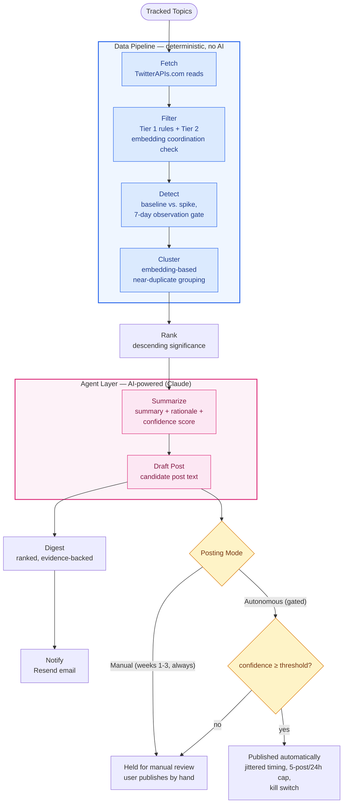

# X Hype Finder

[](https://github.com/Bardiyashavandi/x-hype-finder/actions/workflows/tests.yml)
[](LICENSE)
[](pyproject.toml)

Tell it what to watch — a topic, a ticker, a niche — and it does the timeline-watching for you:
spotting real spikes in interest on X, filtering out bots and manufactured hype, and delivering a
short, ranked, evidence-backed digest of what's actually gaining traction and why.

## Table of Contents

- [About The Project](#about-the-project)
- [Architecture](#architecture)
- [Built With](#built-with)
- [Getting Started](#getting-started)
  - [Prerequisites](#prerequisites)
  - [Installation](#installation)
- [Usage](#usage)
- [Cost Model](#cost-model)
- [Development Process](#development-process)
- [Roadmap](#roadmap)
- [License](#license)

## About The Project

Catching emerging hype on X today means constantly watching timelines by hand — which doesn't
scale past a topic or two, and bot/engagement-farming noise makes it hard to trust what looks like
real interest. Enterprise social-listening tools (Brandwatch, Sprinklr, Sprout Social) already
solve this well — real-time capture, sentiment analysis, AI-generated trend narratives — which is a
strong signal the underlying problem is real. But they're built for a different buyer: brand, PR,
and growth teams, priced in the hundreds-to-thousands-per-month range, centered on "what are people
saying about my brand." There's no lightweight, topic-agnostic version built for a curious
individual who just wants to track a topic, ticker, or niche they care about.

X Hype Finder is that version: any topic as a first-class subject, reasoned about with an LLM
rather than a fixed metrics dashboard, on a personal-project budget (see [Cost
Model](#cost-model)). What comes back isn't a wall of raw posts or a dashboard full of numbers —
it's a short, ranked summary: what's trending, why, and how confident the system is that it's real
signal rather than manufactured hype, with the original source posts always one click away.

Full pitch, market analysis, competitive gap, and target users:
[`docs/Product_Brief_X_Hype_Finder.md`](docs/Product_Brief_X_Hype_Finder.md). Detailed
requirements, architecture, and cost model: [`docs/PRD_X_Hype_Finder_.md`](docs/PRD_X_Hype_Finder_.md).

## Architecture

The system is a strict two-layer split: a **deterministic data pipeline** (rules, statistics, and
embeddings — local via Ollama or hosted via Voyage AI, see [Getting Started](#getting-started) — no
LLM, fully reproducible and unit-testable) hands off to a small **AI agent layer** (Claude) only for
the two stages that genuinely require language judgment — writing the summary and drafting the
post. Everything downstream of a draft is gated by an explicit posting state machine, never a
silent auto-publish.



Stage by stage:

- **Fetch** (`src/pipeline/fetch*.py`) — pulls raw posts for each tracked topic from a pluggable
  third-party X data provider (see [Built With](#built-with)), never the official X read API (100x
  the cost at this volume). Provider-agnostic: every backend returns the same `RawPost`/author-metadata
  shape, selected via `FETCH_PROVIDER` (`src/pipeline/fetch_provider.py`) — same pattern as the
  embedding provider below.
- **Filter** (`src/pipeline/filter.py`) — two tiers, both rule-based. Tier 1 scores each post's
  author metadata (account age, follower/following ratio, posting frequency) against fixed
  thresholds; Tier 2 embeds post text to catch coordinated/duplicate-content bot campaigns a single
  post's metadata wouldn't reveal. No LLM judgment calls what counts as spam.
- **Detect** (`src/pipeline/detect.py`) — compares a topic's current filtered post volume against
  its *own* trailing baseline, never another topic's. Rather than flagging a spike at a fixed
  multiple of the baseline mean (e.g. "3x everything"), which is miscalibrated across volume
  regimes — count data's variance scales with its mean, so a flat ratio is too loose for a
  low-volume topic (ordinary noise clears it trivially) and too tight for a high-volume one (a real
  trend may never reach it) — a spike is current activity clearing the baseline mean by **`K_SIGMA`
  (2.5) effective standard deviations**, a threshold that adapts to each topic's own volume and
  variance instead of one fixed ratio for every topic. Every newly tracked topic also serves a
  **7-day observation period** during which `is_spike` is unconditionally `False`, regardless of
  activity — there's no baseline yet to compare against honestly.
- **Cluster** (`src/pipeline/cluster.py`) — groups filtered posts into themes by embedding
  near-duplicate/related content together, so the digest reads as a handful of coherent stories
  instead of a flat list of individual posts.
- **Rank** (`src/pipeline/rank.py`) — orders every theme across every topic in the run by
  significance, descending, so the digest surfaces the highest-signal items first.
- **Summarize / Draft Post** (`src/agent/`) — the only two stages that call an LLM (Claude), and
  only *after* the deterministic pipeline has already decided what's significant: the model
  explains and drafts, it never decides what counts as a spike or filters noise itself.
- **Posting gate** (`src/posting/`) — every draft is held for manual publishing during a 3-week
  validation period, regardless of confidence. After that, an explicit, reversible toggle enables
  confidence-gated autonomous posting, safeguarded by a live "automated" bio-label check, jittered
  timing, a 5-posts/24h cap, and a kill switch.

## Built With

- **[Python](https://www.python.org/) 3.11+** — the entire application, CLI included (no web/GUI
  dashboard in this MVP).
- **[Claude](https://www.anthropic.com/claude) (`claude-sonnet-5`)** — Summarize and Draft Post,
  the two stages that need language judgment.
- **[Ollama](https://ollama.com) (`nomic-embed-text`, default) / [Voyage AI](https://www.voyageai.com)
  (`voyage-4-lite`, opt-in)** — embeddings for Filter Tier 2's coordinated-content check and
  Cluster, pluggable via `EMBEDDING_PROVIDER`.
- **[TwitterAPIs.com](https://www.twitterapis.com) (default) / [TwitterAPI.io](https://twitterapi.io)
  (alternative)** — third-party X data read providers, pluggable via `FETCH_PROVIDER`; both far
  cheaper at this read volume than the official X read API.
- **[tweepy](https://www.tweepy.org/)** — the official X API v2, used only for posting (each user's
  own account) and the live "automated" bio-label check.
- **[SQLAlchemy](https://www.sqlalchemy.org/) + [Alembic](https://alembic.sqlalchemy.org/)** — ORM
  and schema migrations, SQLite by default.
- **[APScheduler](https://apscheduler.readthedocs.io/)** — the long-lived scheduler process
  (scheduled digest runs, `SourcePost` retention sweep).
- **[Resend](https://resend.com/)** — digest-completion email notifications.
- **[uv](https://docs.astral.sh/uv/)** — dependency management and the dev/CI toolchain.
- **[pytest](https://docs.pytest.org/) / [ruff](https://docs.astral.sh/ruff/) /
  [black](https://black.readthedocs.io/)** — tests, linting, formatting; enforced on every push and
  PR via [GitHub Actions](.github/workflows/tests.yml).

## Getting Started

### Prerequisites

- **Python 3.11+** and [`uv`](https://docs.astral.sh/uv/) (or `pip`).
- An embedding provider (see [Built With](#built-with)) — pick one:
  - **Ollama (default, free)** — install [Ollama](https://ollama.com), running locally, with the
    embedding model pulled:
    ```sh
    ollama pull nomic-embed-text
    ```
  - **Voyage AI** — no local install; just a `VOYAGE_API_KEY` (see Installation below).
- API keys/credentials for whichever Fetch provider, the Claude API, Resend, and each user's own X
  OAuth app — all set via `.env` (next section).

### Installation

1. Install dependencies:
   ```sh
   uv sync
   ```
2. Copy `.env.example` to `.env` and fill in real values — **every** variable it lists is
   documented inline there (what it's for, which are required vs. provider-conditional). At a
   glance:

   | Variable(s) | Purpose |
   |---|---|
   | `FETCH_PROVIDER`, `TWITTERAPIS_COM_KEY` / `TWITTERAPI_IO_KEY` | X data reads (default: TwitterAPIs.com) |
   | `EMBEDDING_PROVIDER`, `VOYAGE_API_KEY` | Embeddings (default: local Ollama, no key needed) |
   | `ANTHROPIC_API_KEY` | Summarize / Draft Post (Claude) |
   | `RESEND_API_KEY`, `RESEND_FROM_EMAIL` | Digest-completion email notifications |
   | `X_API_KEY__<HANDLE>` etc. (per user) | Each user's own X OAuth posting credentials, namespaced by their `x_account_handle` |

   `.env` is gitignored — never commit real credentials (Constitution V, FR-021).
3. Apply database migrations:
   ```sh
   uv run alembic upgrade head
   ```

This project was built with [GitHub's spec-kit](https://github.com/github/spec-kit) — see
[Development Process](#development-process) below for the toolchain used to go from idea to shipped
feature.

## Usage

The CLI is the entire user-facing interface (no web dashboard in MVP scope). Full command
reference, every flag, and every error case: [`docs/cli-usage.md`](docs/cli-usage.md).

```sh
# Track topics
python -m src.cli.topic add "$AAPL" --handles aapl_news
python -m src.cli.topic list
python -m src.cli.topic remove "$AAPL"

# Run and read digests
python -m src.cli.digest run                        # all active topics
python -m src.cli.digest run --topic "$AAPL"         # single topic, on demand
python -m src.cli.digest show <digest-id> --full     # full source evidence, not just examples

# Posting mode
python -m src.cli.posting mode show
python -m src.cli.posting mode set autonomous        # gated: validation period + live bio-label check
python -m src.cli.posting kill-switch on

# Manually-held drafts (the default during the 3-week validation period)
python -m src.cli.drafts list --status held_manual
python -m src.cli.drafts mark-published <draft-id>

# Scheduler (long-lived process — runs scheduled digests + retention sweep for every user)
python -m src.cli.scheduler run
```

`digest run` above is on-demand and one-shot. To get the automatic, scheduled digest cadence plus
the periodic retention sweep running in the background, start the scheduler as its own long-lived
process — see [`docs/cli-usage.md#scheduler`](docs/cli-usage.md#scheduler) for cadence flags.

Example output — `topic list`:

```
AI agents	first_tracked_at=2026-07-22T10:25:02.671979	in_observation_period=no
SOL	first_tracked_at=2026-07-31T09:43:48.673752	in_observation_period=yes
```

Example output — `posting mode show`:

```
mode:                      manual
confidence_threshold:      70
validation_period_ends_at: 2026-08-16T12:57:44.219157
kill_switch_engaged:       False
last_post_published_at:    -
```

## Cost Model

Budget is a fixed **one-time $50 total** (not a monthly allowance), so the design pushes every
stage that doesn't need language judgment onto free, local infrastructure:

| Component | Approach | Cost |
|---|---|---|
| Embeddings (clustering + Filter Tier 2) | Local Ollama (`nomic-embed-text`, default) or hosted Voyage AI (`voyage-4-lite`, opt-in via `EMBEDDING_PROVIDER=voyage`) | $0 (ollama) / usage-based (voyage) |
| Filter Tier 1, Detect, Cluster, Rank | Deterministic rules/statistics, in-process | $0 |
| X data reads | TwitterAPIs.com (default, ~$0.04/1K reads) or TwitterAPI.io (~$0.15/1K reads), pluggable via `FETCH_PROVIDER` | ~$1-4.50/mo at MVP scale |
| Summarize + Draft Post | Claude (`claude-sonnet-5`, reassessed for `claude-haiku-4-5` after the week-3 checkpoint) | ~$2-9/mo, tracked against a $5 credit |
| X posting | Official X API v2, capped at 5 posts/24h | ~$2.25/mo worst case |
| Notifications | Resend free tier | $0 |

**Observed from live runs (2026-07-31):** the table above is the planning estimate. Two real
end-to-end `digest run`s against live services give two real data points so far:

| Run | Topics | Posts fetched | Themes produced | Cost |
|---|---|---|---|---|
| Single-topic | 1 ("AI agents") | 40 | 37 | ~$0.41 |
| Multi-topic | 2 ("AI agents" + "SOL") | 80 | 63 | ~$0.65 |

Cost tracks with topic count and theme volume, not a fixed per-run number — almost all of it is
Claude Summarize/Draft Post calls (one pair of calls per theme, occasionally more on a
length-correction retry), with Fetch itself contributing a few tenths of a cent. Real spend, not a
projection, but not yet enough samples to replace the per-component estimate above — kept here as
data points to weigh it against.

A running cost ledger (`src/utils/cost_tracker.py`) tracks cumulative spend against the $50 total,
with an explicit reassess-and-possibly-downgrade checkpoint at the week-3 posting-mode switch
rather than an open-ended commitment to the pricier model. Full reasoning:
[`specs/001-x-hype-finder-mvp/research.md`](specs/001-x-hype-finder-mvp/research.md).

## Development Process

This repo was built with [GitHub's spec-kit](https://github.com/github/spec-kit): a project
**constitution** (non-negotiable engineering principles — e.g. the pipeline/agent determinism split
in [Architecture](#architecture)) governs a per-feature **spec** (user stories, requirements,
acceptance criteria), which becomes a **plan** (architecture, tech stack, research decisions) and a
**tasks** breakdown (dependency-ordered, testable units of work) — implemented task-by-task against
that trail, rather than freeform prompting against a vague idea.

Everything is checked in and readable:
[`specs/001-x-hype-finder-mvp/`](specs/001-x-hype-finder-mvp/) has the full spec, plan, research
notes, data model, API/CLI contracts, and the complete task breakdown (all 72 tasks, done) behind
this implementation. Every push and pull request also runs the full test suite plus lint/format
checks automatically — [`.github/workflows/tests.yml`](.github/workflows/tests.yml).

## Roadmap

**Built — validated MVP, all 5 user stories implemented, 236 passing tests:**

| User Story | Scope | PR |
|---|---|---|
| US1 | End-to-end hype digest pipeline (Fetch→Filter→Detect→Cluster→Summarize→Rank) | [#1](https://github.com/Bardiyashavandi/x-hype-finder/pull/1) |
| US2 + US3 | On-demand triggering, full source drill-down | [#2](https://github.com/Bardiyashavandi/x-hype-finder/pull/2) |
| US4 | Manual-first, then confidence-gated autonomous posting | [#3](https://github.com/Bardiyashavandi/x-hype-finder/pull/3) |
| US5 | Multi-user isolation (data, credentials, process identity) | [#4](https://github.com/Bardiyashavandi/x-hype-finder/pull/4) |
| Polish | CLI docs, retention job, security review, coverage gaps | [#5](https://github.com/Bardiyashavandi/x-hype-finder/pull/5) |
| — | Pluggable embedding providers (Ollama default, Voyage AI alternative) | [#9](https://github.com/Bardiyashavandi/x-hype-finder/pull/9) |
| — | Pluggable Fetch providers (TwitterAPIs.com default, TwitterAPI.io alternative) | [#11](https://github.com/Bardiyashavandi/x-hype-finder/pull/11) |
| — | CI (GitHub Actions), real cost-model validation data | [#12](https://github.com/Bardiyashavandi/x-hype-finder/pull/12) |

**Open:**

- **Real second-user validation.** Currently one pilot user in the 3-week manual-only validation
  period (through 2026-08-16); the Product Brief's target of two real, engaged users hasn't
  happened yet.
- **Formal bot-filtering / detection accuracy measurement.** Signal Recall (≥75% target) and
  Flagged-Signal Precision (≥70% target against a ≥50-post hand-labeled set) are both defined as
  success metrics but not yet measured against real, labeled data — currently validated only via
  unit/contract tests against synthetic fixtures.
- **Autonomous posting switch-on**, once the manual validation period actually confirms digests and
  drafts are trustworthy in practice — currently every draft is `held_manual` regardless of
  confidence.
- **Phase 4 (Product Brief §16):** a lightweight dashboard as an alternative to the digest format,
  and revisiting market demand with users beyond the initial pilot.

## License

Distributed under the MIT License. See [`LICENSE`](LICENSE) for the full text.
